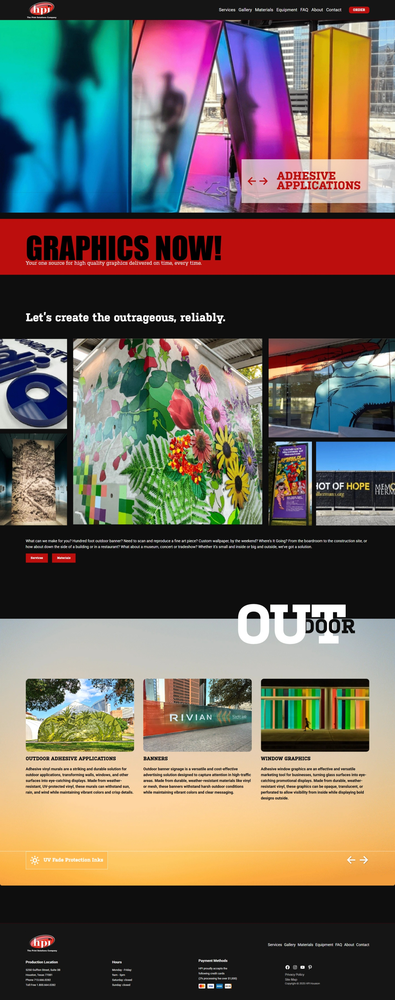
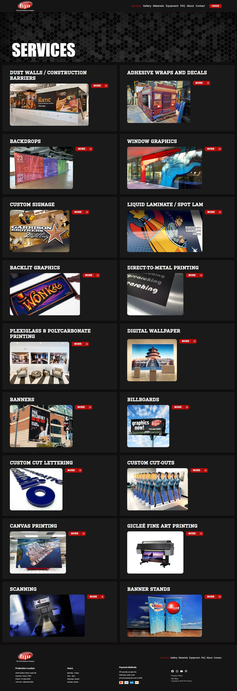
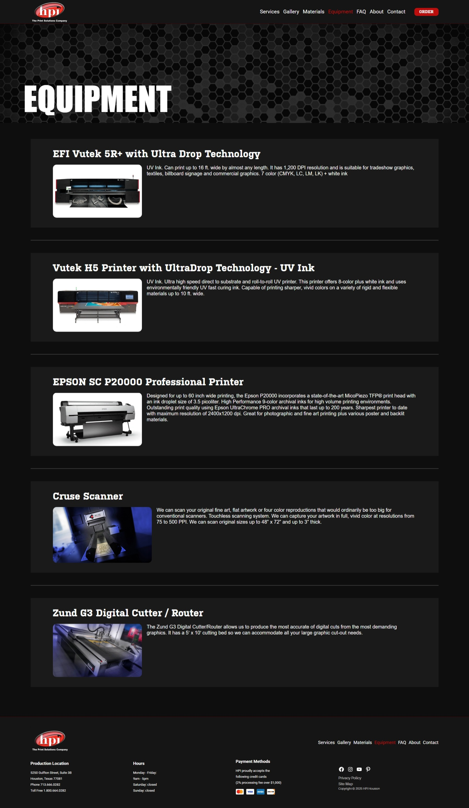
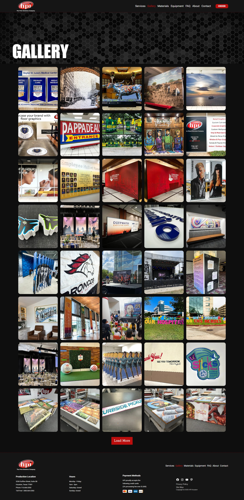
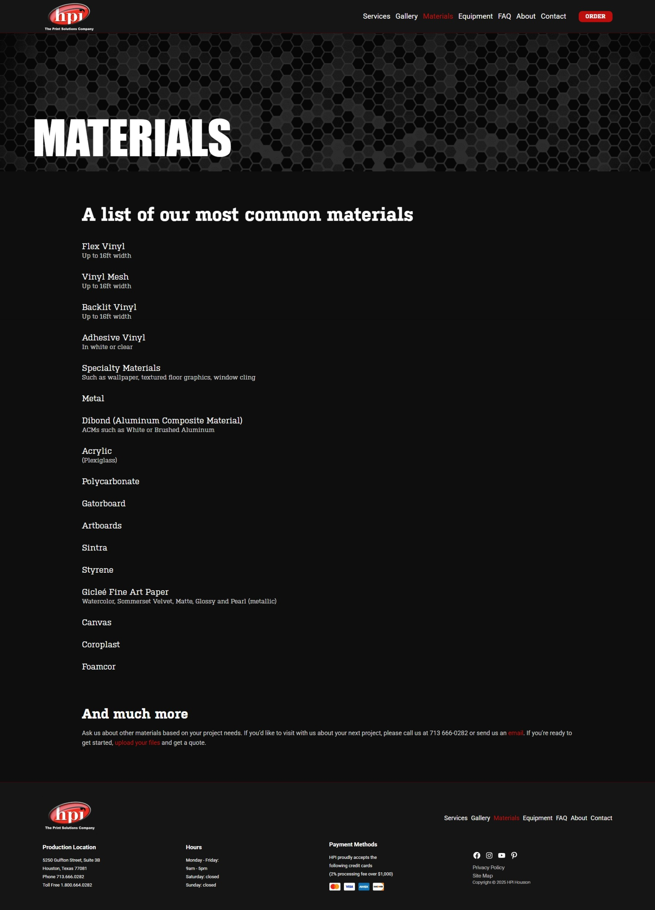
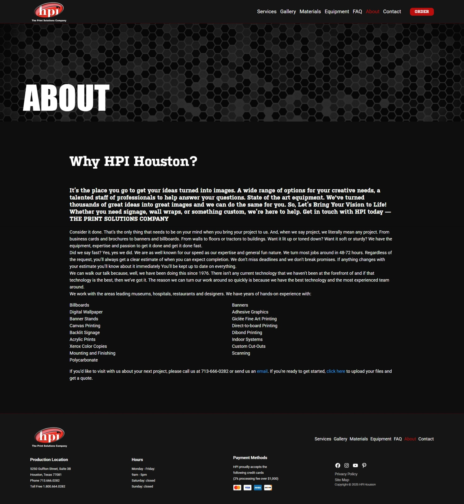
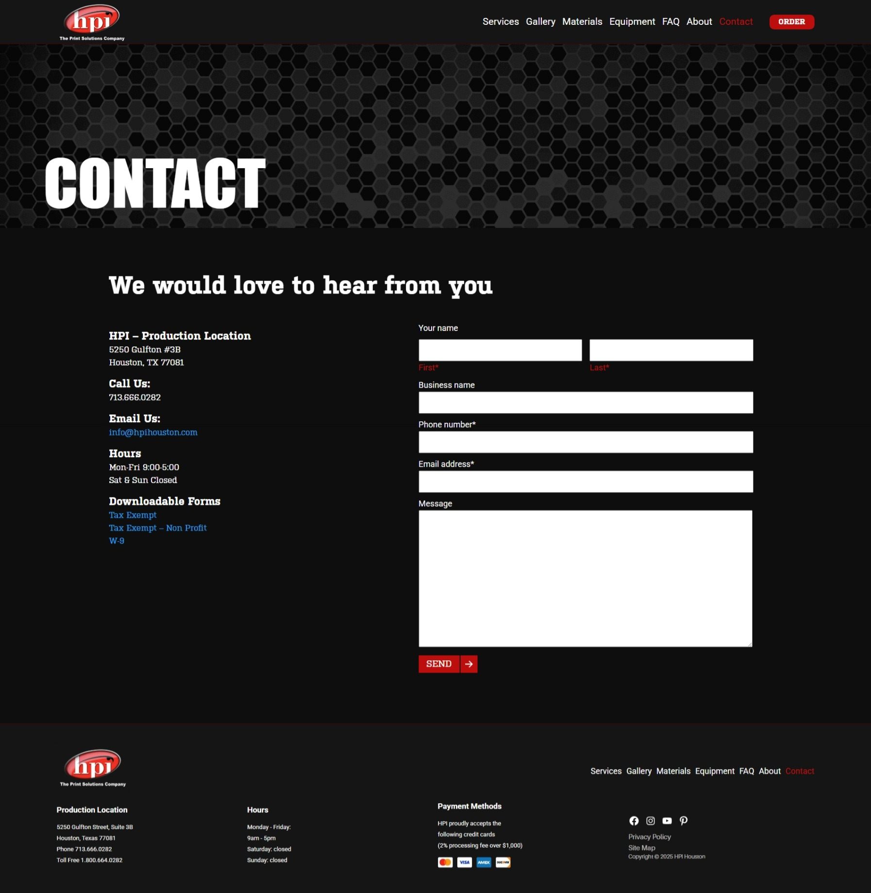
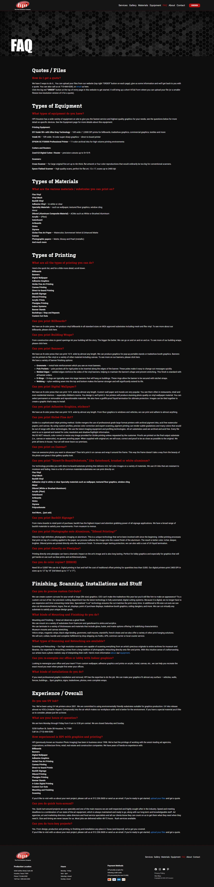

# 🎨 HPI Houston
Large-Format Printing and Custom Art Production
HPI Houston specializes in bringing our clients' creative vision to life, regardless of the size or location. From giant outdoor banners to detailed fine art reproductions, we offer customized printing solutions for every need.

# 📌 Introduction
What can we make for you?
Hundred foot outdoor banner? Need to scan and reproduce a fine art piece? Custom wallpaper, by the weekend?

HPI Houston is your high-quality production partner, capable of handling large-format art and printing projects with speed and precision. We combine advanced technology with craftsmanship to ensure your message or art piece looks perfect at any scale.

# 📍 Where Will It Be Installed?
Where’s It Going?
Our versatility allows us to serve a wide variety of environments and clients. We have proven solutions for:

* Corporate Environments: From the boardroom to informational signage.
* Construction Sites: Giant banners and scrims for building façades.
* Retail and Hospitality: Interior décor for restaurants, stores, and hotels (e.g., custom wallpaper).
* Culture and Events: Exhibits for museums, marketing materials for concerts, and tradeshow booths.

# 🛠️ Key Services
Our main services cover the entire spectrum of art and graphics production:

* Large-Format Printing: Outdoor banners of any size.
* Fine Art Reproduction: High-resolution scanning and faithful reproduction of art pieces.
* Custom Interior Décor: Custom wallpaper printing, wall graphics, and internal signage.
* Event Production: Graphic materials for tradeshows, concerts, and exhibitions.

# 🖼️ Preview

  
  
  
  
  
  
  
  

# ⚙️ Requirements

- WordPress
- Advanced Custom Fields (ACF)
